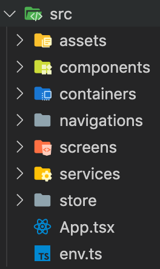

<div style="display: flex; justify-content: center; align-items: center">


</div>

# Introduction
A project template which **fully configured** for production using **container pattern**, shipped with Typescript to provide strongly type checking
# What's include
- React navigation
- Redux
- Redux-persist (to persist data when app reload/or goes offline)
- Redux-thunk
- SocketIO middleware (optional)
- Path alias to enable friendly import path
# Setup
First you need to clone this repo

Then run the following commands:
```
yarn install
cd ios && pod install
```

And run as normal React Native project with:
```
react-native run-ios
react-native run-android
```
# Project structure
<div align="center">

</div>

Explain:
- **assets**: to put images, icons,...
- **components**: contains reusable components
- **containers**: components that connect your React components/screens with Redux store
- **navigations**: contains all your navigation configurations (stack/tab..)
- **screens**: contains all screens for your app
- **services**: services that your app needs (axios, navigation service, ...)
- **store**: your Redux store
- **App.tsx**: your main application component
- **env.ts**: contains common variables for your app
# Note
- Hermes is enable by default for running on Android to make your app start faster. If you want to disable it, set `enableHermes` to `false` in `android/app/build.gradle`
- Path alias is set to `@`, if you want to change it then change in both `babel.config.js` and `tsconfig.json`